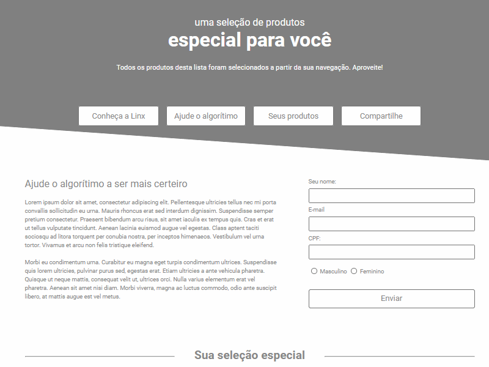

<h3 align="right">
    Just html 🔴🟡🟢
</h3>

<h1>
    
</h1>

## 🔥 | ABOUT

#### Project for the challenge prepared by **Linx**, creating a responsive website based on a predetermined layout. The goal is to build an **eCommerce application** that contains a product grid and a newsletter form.

##### [Layout link]( https://xd.adobe.com/spec/4025e242-a495-4594-71d2-5fd89d774b57-3614) | [EndPoint da API]( https://frontend-intern-challenge-api.iurykrieger.now.sh/products?page=1)

---

## 🐱‍👤| STACK TECHNOLOGIES

#### Developed with the following technologies

- [HTML5](https://developer.mozilla.org/en-US/docs/Web/Guide/HTML/HTML5)
- [CSS3](https://developer.mozilla.org/en-US/docs/Web/CSS)
- [JavaScript](https://developer.mozilla.org/en-US/docs/Web/JavaScript)

---
## RUNNING

Deployed on "Vercel"

#### site: https://ecommerce-linx.vercel.app/
#### email: https://ecommerce-linx.vercel.app/emailmarketing.html

__

As there is a restriction on an email page in relation to additional files such as CSS and JavaScript, there was a need to create all the **html** logic in a single file to the maximum to avoid rendering errors.

---

Created by Arthur Araujo.

